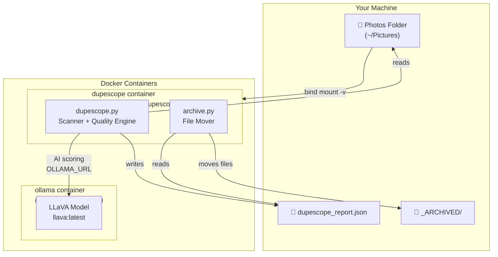
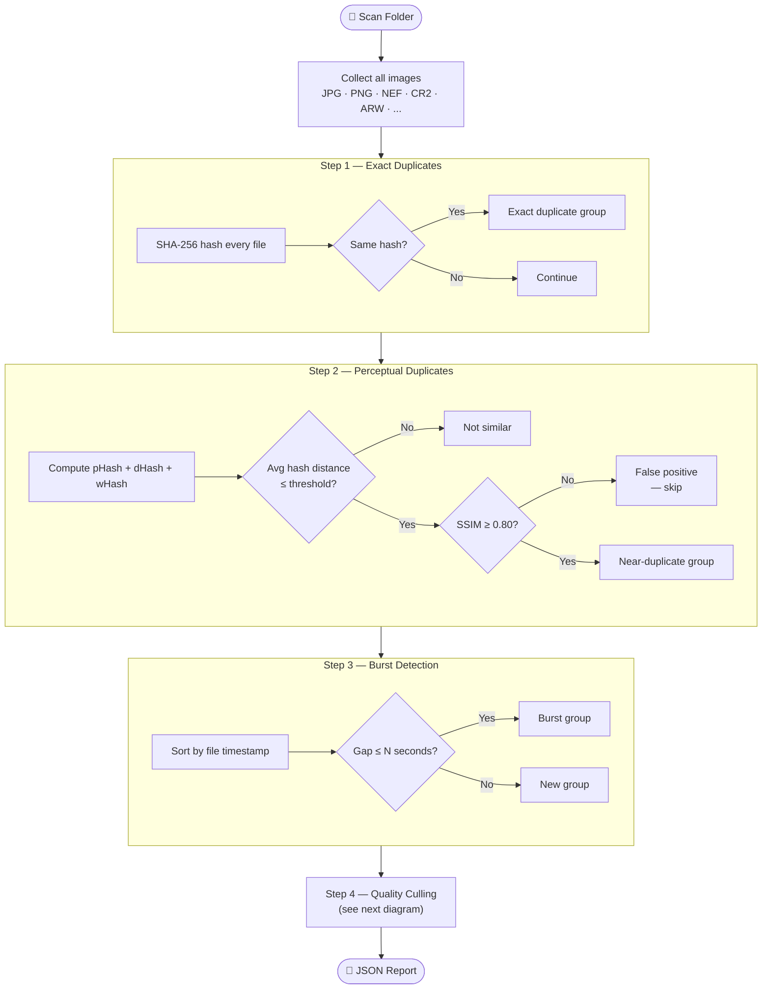
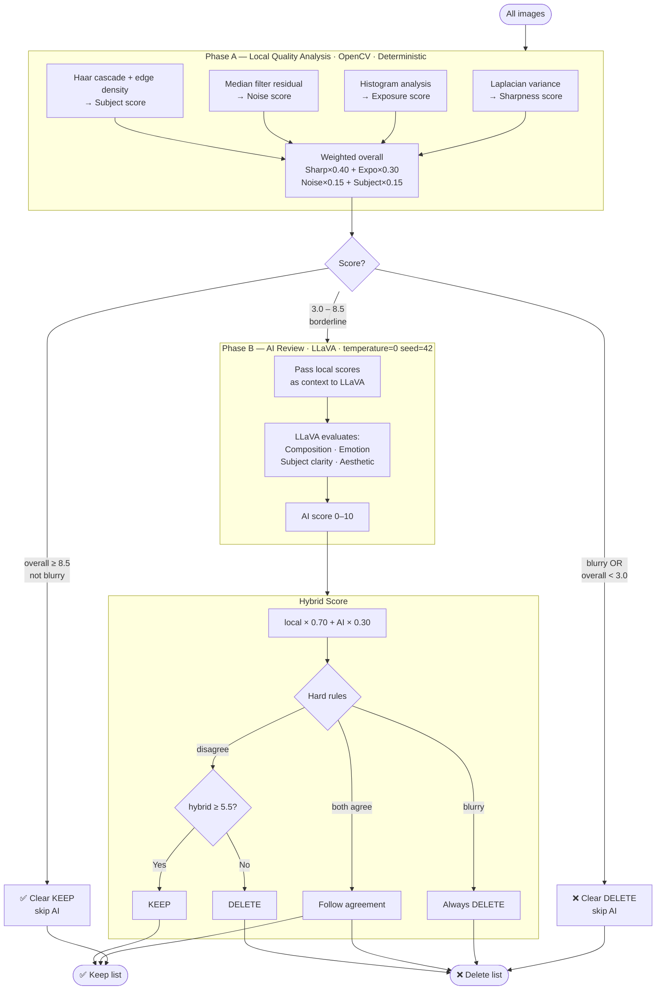
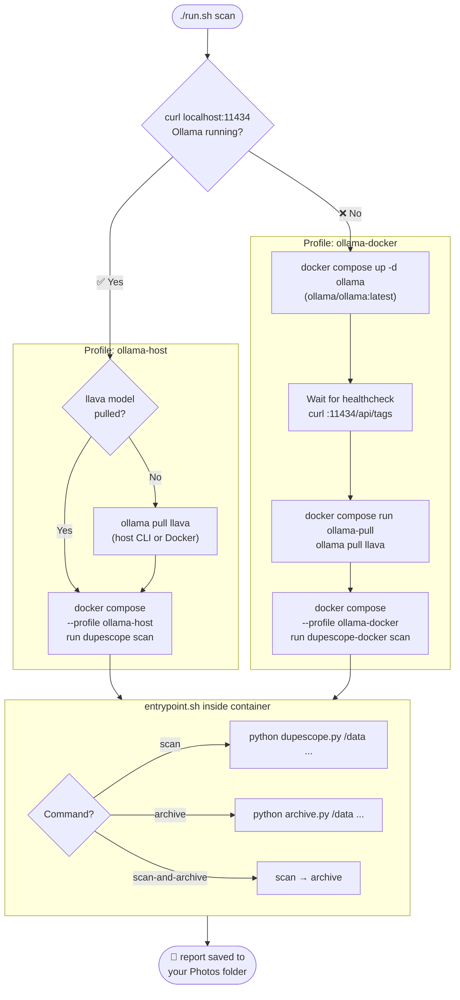

# Fotography AI - Duplicate Photo Detector with AI Culling

Fotography AI is a privacy-first, offline duplicate photo detector that helps you manage your photo library. It can identify exact duplicate images using SHA-256 hashing, find perceptually similar images using pHash, and even leverage AI for culling images based on quality metrics. The project consists of a Python backend and a React frontend.

## Features

*   **Exact Duplicate Detection**: Identifies images that are byte-for-byte identical using SHA-256 hashing.
*   **Perceptual Duplicate Detection**: Finds visually similar images even if they have minor differences (e.g., compression, slight edits, crops) using pHash.
*   **AI Culling**: Utilizes a local LLaVA model (via Ollama) to evaluate image quality (sharpness, exposure, subject presence, composition, emotion) and suggest which images to keep or delete.
*   **Web UI**: A React-based frontend for easy interaction and visualization of duplicate groups and AI culling results.
*   **Offline Operation**: All processing happens locally on your machine; no data leaves your system.

## Prerequisites

To run this project, you will need:

*   **Devbox**: Used to manage the development environment and dependencies (Node.js, Python, Git, FFmpeg).
*   **Ollama**: Required for the AI Culling feature to run the LLaVA model locally. Ensure Ollama is installed and the `llava` model is pulled (`ollama pull llava`).

## Setup

1.  **Install Devbox**: Follow the instructions on the [Devbox website](https://www.jetpack.io/devbox/docs/installing-devbox/) to install Devbox.
2.  **Install Ollama**: Download and install Ollama from the [Ollama website](https://ollama.com/download).
    *   **Using Homebrew (macOS/Linux)**:
        ```bash
        brew install ollama
        ollama serve # Start the Ollama service
        ```
    *   **Using Docker Compose**:
        Create a `docker-compose.yml` file (e.g., in `fotography_ai/open-webui/compose.yml` as seen in your project structure, or a new one):
        ```yaml
        version: '3.8'
        services:
          ollama:
            image: ollama/ollama:latest
            ports:
              - "11434:11434"
            volumes:
              - ollama_data:/root/.ollama
            restart: always
        volumes:
          ollama_data:
        ```
        Then run:
        ```bash
        docker-compose up -d
        ```
3.  **Pull LLaVA Model**: Once Ollama is installed, pull the LLaVA model by running the following command in your terminal:
    ```bash
    ollama pull llava
    ```
4.  **Clone the Repository**: If you haven't already, clone the `fotography_ai` repository to your local machine.
    ```bash
    git clone <repository_url>
    cd fotography_ai
    ```
5.  **Initialize Devbox Environment**: Navigate to the `fotography_ai` directory and initialize the Devbox environment. This will install all necessary dependencies (Node.js, Python, etc.).
    ```bash
    devbox shell
    ```
    You should see output indicating that the Devbox AI environment is ready.

## Running the Application

Once the Devbox environment is set up, you can start the backend and frontend services.

1.  **Start Services**: From within the `devbox shell`, run the following command:
    ```bash
    devbox run start
    ```
    This command will concurrently start:
    *   The Python Flask backend (`dupescope-backend/server.py`) on `http://127.0.0.1:5000`.
    *   The React development server for the frontend (`dupescope-ui`) on `http://localhost:5173` (or another available port).

    You can also start them individually:
    *   **Backend only**: `devbox run backend`
    *   **Frontend only**: `devbox run frontend`

2.  **Access the UI**: Open your web browser and navigate to the address provided by the frontend (usually `http://localhost:5173`).

## Usage

1.  **Specify Folder**: In the web UI, enter the path to the folder containing the images you want to scan.
2.  **Select Mode**: Choose your desired detection mode:
    *   **Exact**: Finds byte-for-byte identical duplicates.
    *   **Perceptual**: Finds visually similar images. You can adjust the `threshold` for sensitivity.
    *   **Both**: Runs both exact and perceptual detection.
    *   **AI Culling**: (Requires Ollama and LLaVA model) Evaluates images based on quality metrics.
3.  **Start Scan**: Click the "Scan" button to begin the process.
4.  **Review Results**: The UI will display groups of duplicate or similar images, and for AI culling, it will show suggested images to keep or delete.

## Project Structure

*   `dupescope-backend/`: Contains the Python Flask backend for image scanning and duplicate detection.
    *   `server.py`: The Flask application that exposes API endpoints for scanning.
    *   `dupescope.py`: Core logic for SHA-256 hashing, pHash calculation, and AI culling integration.
*   `dupescope-ui/`: The React frontend application.
*   `devbox.json`: Devbox configuration file, defining the development environment and scripts.
*   `dupescope_report.json`: (Generated) Output file for scan reports.

## Devbox Commands

Here are the `devbox` commands defined in `devbox.json`:

*   `devbox shell`: Enters the Devbox environment, installing necessary packages.
*   `devbox run start`: Starts both the backend and frontend concurrently.
*   `devbox run backend`: Starts only the Python Flask backend.
*   `devbox run frontend`: Starts only the React frontend development server.

## Test API using Python
```
# No server needed — uses built-in mock data
python server_api_tests.py --mock

# Against your live server
python server_api_tests.py --folder ~/Pictures
# expicitly:
python server_api_tester.py --base http://localhost:5000 --folder ~/Pictures

# Run only one suite
python server_api_tests.py --mock --suite scan
python server_api_tests.py --mock --suite health
python server_api_tests.py --mock --suite report
python server_api_tests.py --mock --suite delete
python server_api_tests.py --mock --suite cache
python server_api_tests.py --mock --suite jobs
```

# 🧹 DupeScope Report Archiver & Processor

This script processes JSON reports generated by DupeScope and archives files flagged for deletion (from the `ai_delete` list). It safely moves those files into an `_ARCHIVED` folder and generates a structured summary report.

---

## 🚨 ⚠️ CRITICAL SAFETY WARNING ⚠️ 🚨

**DO NOT RUN THIS SCRIPT ON YOUR LIVE DATA WITHOUT TESTING FIRST.**

- The script uses `shutil.move()` which physically relocates files.
- Your reports may contain **absolute paths** (e.g. `/Users/...`), meaning files **outside your working directory can be moved**.
- Always run with `--dry-run` first to preview changes.
- Always keep a backup of important files.

---

## ✅ Features

- Processes all `*report.json` files recursively
- Supports both **absolute and relative paths**
- Prevents filename collisions in `_ARCHIVED`
- Generates a detailed `processed-summary.json`
- Includes a **dry-run mode** (no file changes)
- Handles invalid or missing entries safely

---

## 📦 Usage

### 1. Prerequisites

- Python 3.8+

---

### 2. Run the script

#### 🔴 Real execution (moves files)
```bash
python process_dupescope_report.py /path/to/root_directory

```
---

# ◈ DupeScope

> **Privacy-first, fully offline duplicate photo detector with AI-assisted culling.**  
> No data leaves your machine. No cloud. No subscriptions.

[](https://github.com/sankhasil/dupescope/pkgs/container/dupescope)
[](https://github.com/sankhasil/dupescope/actions/workflows/docker.yml)


---

## What it does

DupeScope scans a folder of photos and:

- Finds **exact duplicates** (byte-for-byte identical files)
- Finds **near-duplicates** (same shot, different compression, slight crop or edit)
- Detects **burst groups** (photos taken within seconds of each other)
- Scores every photo on **objective quality metrics** (sharpness, exposure, noise)
- Uses **LLaVA AI** to judge composition and aesthetics on borderline images
- Produces a **JSON report** with keep/delete recommendations
- **Safely archives** suggested deletes to `_ARCHIVED/` — nothing is permanently deleted

---

## System Architecture



---

## Detection Pipeline



---

## Quality Culling Pipeline



---

## Docker & Ollama Launch Flow



---

## CI/CD Pipeline

```mermaid
flowchart LR
    PUSH(["git push\nor git tag v1.x.x"]) --> GHA

    subgraph GHA["GitHub Actions · docker.yml"]
        CHECKOUT["actions/checkout"]
        CHECKOUT --> BUILDX["docker/setup-buildx"]
        BUILDX --> LOGIN["Login to ghcr.io\nGITHUB_TOKEN auto-provided"]
        LOGIN --> META["docker/metadata-action\nGenerate tags"]
        META --> BUILD["docker/build-push-action\ncontext: .\nfile: exectutorDocker/Dockerfile"]
    end

    BUILD --> REGISTRY

    subgraph REGISTRY["GitHub Container Registry"]
        LATEST["ghcr.io/sankhasil/dupescope:latest"]
        BRANCH["ghcr.io/sankhasil/dupescope:main"]
        VER["ghcr.io/sankhasil/dupescope:1.0.0"]
    end

    REGISTRY --> PULL(["docker pull\ndocker compose\nrun.sh"])
```



---

## Project Structure

```
fotography_ai/
├── .github/
│   └── workflows/
│       └── docker.yml          # CI/CD — builds & pushes image on every push
│
├── exectutorDocker/
│   ├── Dockerfile              # Image recipe — installs deps, copies scripts
│   └── entrypoint.sh           # CLI router: scan / archive / scan-and-archive
│
├── dupescope-backend/
│   ├── dupescope.py            # Core scanner + quality engine (v2)
│   ├── archive.py              # Report processor — moves files to _ARCHIVED/
│   └── requirements.txt        # Python dependencies
│
├── docker-compose.yml          # Profiles: ollama-host / ollama-docker
└── run.sh                      # Smart launcher — auto-detects Ollama
```

---

## Quick Start

### Option 1 — Docker (recommended)

```bash
# Clone
git clone https://github.com/sankhasil/dupescope
cd dupescope

# Make launcher executable
chmod +x run.sh

# Scan your photos
PHOTOS_PATH=~/Pictures ./run.sh scan

# Full pipeline: scan + archive AI-delete files
PHOTOS_PATH=~/Pictures AI_CULL=true ./run.sh scan-and-archive

# Dry run — see what would be archived without touching anything
PHOTOS_PATH=~/Pictures DRY_RUN=true ./run.sh scan-and-archive
```

### Option 2 — Python directly

```bash
cd dupescope-backend

python -m venv venv && source venv/bin/activate

pip install Pillow imagehash opencv-python scikit-image numpy requests rawpy

# Basic scan
python dupescope.py ~/Pictures

# Scan without AI (fast, local metrics only)
python dupescope.py ~/Pictures --no-ai

# Full options
python dupescope.py ~/Pictures \
  --mode both \
  --threshold 10 \
  --burst-gap 3 \
  --output report.json
```

---

## Configuration

All settings are passed as environment variables when using Docker:

| Variable | Default | Description |
|---|---|---|
| `PHOTOS_PATH` | `~/Pictures` | Path to your photos on the host |
| `OLLAMA_URL` | `http://host.docker.internal:11434` | Ollama server URL |
| `MODE` | `both` | `exact` / `perceptual` / `both` |
| `THRESHOLD` | `10` | pHash distance — lower = stricter matching |
| `AI_CULL` | `false` | Enable LLaVA AI culling |
| `DRY_RUN` | `false` | Preview archive moves without executing |
| `NO_RECURSIVE` | `false` | Scan top folder only |
| `OUTPUT` | `dupescope_report.json` | Report filename |

### Ollama URL by OS

| OS | URL |
|---|---|
| macOS / Windows Docker Desktop | `http://host.docker.internal:11434` |
| Linux | `http://172.17.0.1:11434` |
| Remote machine | `http://192.168.x.x:11434` |

---

## Detection Methods Explained

### Exact Duplicates — SHA-256
Computes a cryptographic hash of each file's raw bytes. Two files with the same hash are guaranteed byte-for-byte identical — even if they have different filenames or are in different folders.

### Near-Duplicates — Multi-Hash + SSIM

Three perceptual hash types are computed for every image:

| Hash | Technique | Best for |
|---|---|---|
| `pHash` | Frequency domain (DCT) | Scaling, JPEG recompression |
| `dHash` | Gradient comparison | Near-identical images |
| `wHash` | Wavelet transform | Heavily edited / filtered images |

The **average distance** across all three is used for clustering. This halves false positives compared to a single hash.

SSIM (Structural Similarity Index) then **confirms each candidate pair** — preventing hash collisions from incorrectly grouping different images.

### Quality Scoring — OpenCV

| Metric | Method | Why |
|---|---|---|
| Sharpness | Laplacian variance | Blurry images have low edge variance — deterministic, fast |
| Exposure | Histogram mean + clipping % | Detects blown highlights and crushed shadows |
| Noise | Median filter residual | High-frequency noise estimate |
| Subject | Haar cascade + edge density | Face detection + frame content |

### AI Culling — LLaVA (deterministic)

LLaVA only sees **borderline images** — those not clearly good or bad by local metrics. Two settings make it consistent:

```python
"options": {
    "temperature": 0,  # removes randomness from token sampling
    "seed": 42,        # fixes the random seed
}
```

Without `temperature=0`, LLaVA may score the same image differently on consecutive runs.

### Hybrid Score

```
final_score = local_score × 0.70 + ai_score × 0.30
```

Local metrics are weighted higher because they are **objective and measurable**. AI scores capture artistic qualities but are inherently subjective.

Hard overrides:
- Blurry image → **always delete**, regardless of AI score
- Both local and AI agree → **follow their agreement**
- Disagreement → use hybrid score with threshold 5.5

---

## Output Report Structure

```json
{
  "dupescope_version": "2.0",
  "generated_at": "2024-08-14T10:02:34",
  "scanned_folder": "/Users/you/Pictures",
  "total_images_scanned": 1806,
  "summary": {
    "exact_groups": 3,
    "similar_groups": 12,
    "burst_groups": 8,
    "reclaimable_exact": "42.3 MB",
    "quality_keep": 1420,
    "quality_delete": 386,
    "local_rejects": 210,
    "ai_rejects": 176
  },
  "ai_keep":   [ { "path": "...", "hybrid_score": 8.2, "sharpness": 9.1, ... } ],
  "ai_delete": [ { "path": "...", "hybrid_score": 3.1, "_is_blurry": true, ... } ],
  "exact_groups":   [ { "hash_sha256": "a3f9...", "files": [ ... ] } ],
  "similar_groups": [ { "files": [ ... ] } ],
  "burst_groups":   [ { "files": [ ... ] } ]
}
```

---

## Requirements

### Python (direct usage)
```
Pillow>=10.0.0
imagehash>=4.3.1
opencv-python>=4.8.0
scikit-image>=0.21.0
numpy>=1.24.0
requests>=2.31.0
rawpy>=0.18.1        # RAW file support (NEF, CR2, ARW...)
```

### Docker
- Docker Desktop (Mac/Windows) or Docker Engine (Linux)
- `docker compose` v2+

### AI Culling
- [Ollama](https://ollama.com) running locally with `llava` pulled
- OR: Docker will start Ollama automatically via `run.sh`

---

## Supported Formats

| Category | Extensions |
|---|---|
| Standard | `.jpg` `.jpeg` `.png` `.webp` `.tiff` `.heic` `.avif` `.bmp` `.gif` |
| RAW | `.nef` `.cr2` `.arw` `.dng` `.orf` `.raf` `.rw2` `.raw` |

RAW files are decoded via `rawpy` (LibRaw) with `sips` (macOS) as fallback for newer camera bodies.

---

## Privacy

- **Nothing leaves your machine.** All processing is local.
- LLaVA runs via Ollama — fully offline, no API calls to external services.
- The Docker image has no outbound network access to external services.
- Reports are written to your photos folder — no telemetry, no logging to external systems.

---

## License

MIT — do whatever you want with it.