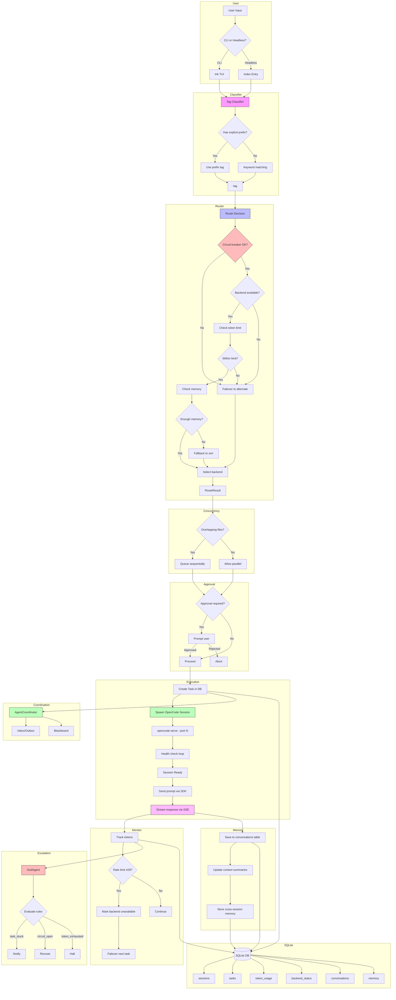
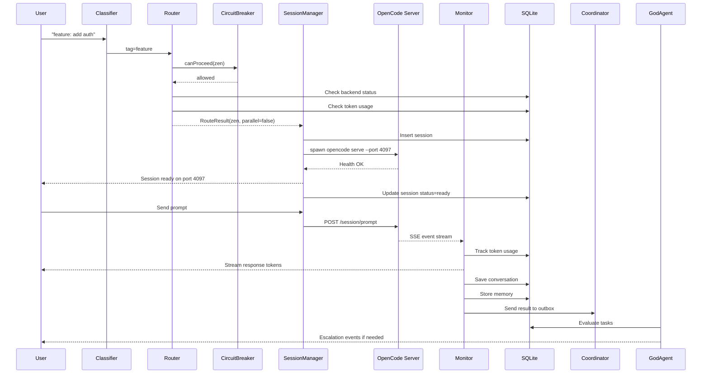
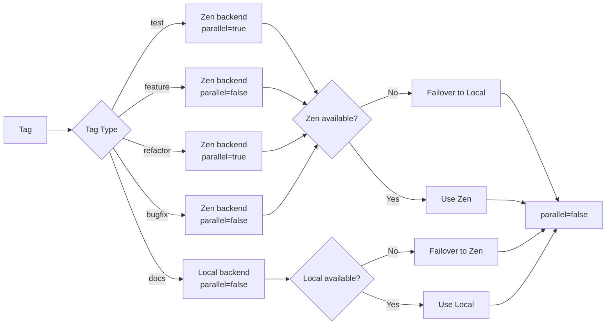
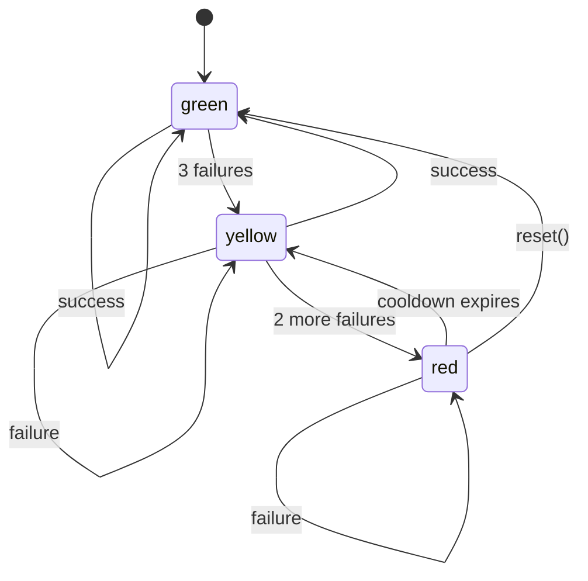
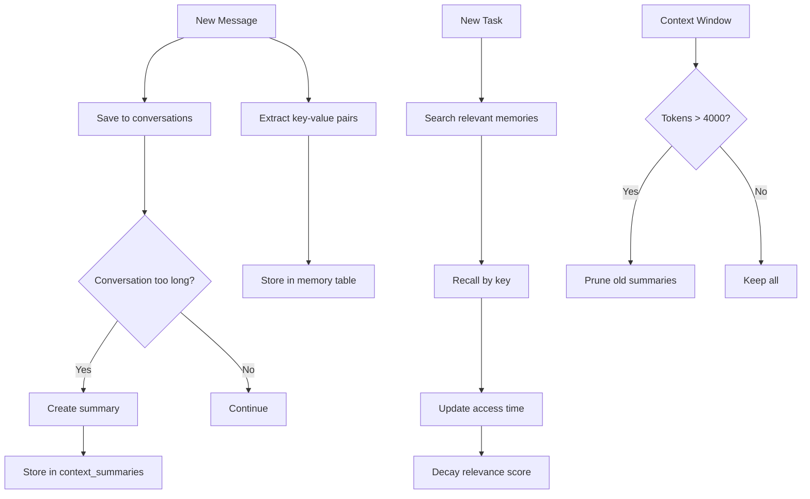
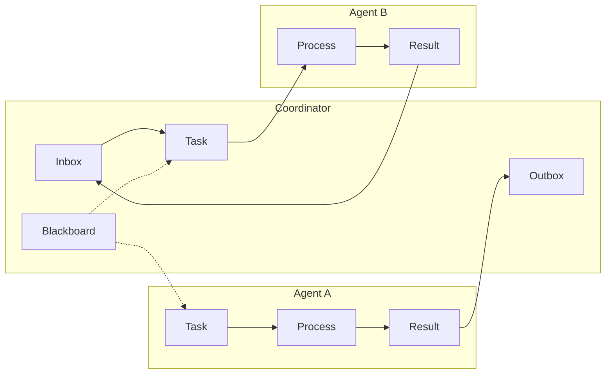
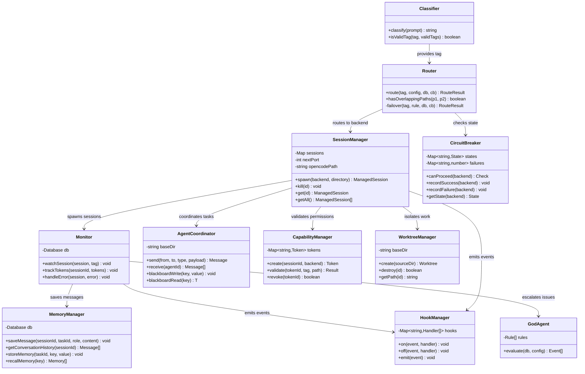

# Solution Design

## System Architecture

```mermaid
flowchart TD
    subgraph User
        A[User Input] --> B{CLI or Headless?}
        B -->|CLI| C[Ink TUI]
        B -->|Headless| D[Index Entry]
    end

    subgraph Classifier
        C --> E[Tag Classifier]
        D --> E
        E --> F{Has explicit prefix?}
        F -->|Yes| G[Use prefix tag]
        F -->|No| H[Keyword matching]
        G --> I[tag]
        H --> I
    end

    subgraph Router
        I --> J[Route Decision]
        J --> CB{Circuit breaker OK?}
        CB -->|No| M[Failover]
        CB -->|Yes| K{Backend available?}
        K -->|Yes| L[Check token limit]
        K -->|No| M[Failover to alternate]
        L --> N{Within limit?}
        N -->|Yes| O[Check memory]
        N -->|No| M
        O --> P{Enough memory?}
        P -->|Yes| Q[Select backend]
        P -->|No| R[Fallback to zen]
        M --> Q
        R --> Q
        Q --> S[RouteResult]
    end

    subgraph Concurrency
        S --> T{Overlapping files?}
        T -->|Yes| U[Queue sequentially]
        T -->|No| V[Allow parallel]
    end

    subgraph Approval
        U --> W{Approval required?}
        V --> W
        W -->|Yes| X[Prompt user]
        X -->|Approved| Y[Proceed]
        X -->|Rejected| Z[Abort]
        W -->|No| Y
    end

    subgraph Execution
        Y --> AA[Create Task in DB]
        AA --> AB[Spawn OpenCode Session]
        AB --> AC[opencode serve --port N]
        AC --> AD[Health check loop]
        AD --> AE[Session Ready]
        AE --> AF[Send prompt via SDK]
        AF --> AG[Stream response via SSE]
    end

    subgraph Monitor
        AG --> AH[Track tokens]
        AH --> AI{Rate limit 429?}
        AI -->|Yes| AJ[Mark backend unavailable]
        AI -->|No| AK[Continue]
        AJ --> AL[Failover next task]
    end

    subgraph Memory
        AG --> AM[Save to conversations table]
        AM --> AN[Update context summaries]
        AN --> AO[Store cross-session memory]
    end

    subgraph Coordination
        AA --> CO[AgentCoordinator]
        CO --> CI[Inbox/Outbox]
        CO --> BB[Blackboard]
    end

    subgraph Escalation
        AH --> GA[GodAgent]
        GA --> ES{Evaluate rules}
        ES -->|task_stuck| NT[Notify]
        ES -->|circuit_open| RR[Reroute]
        ES -->|token_exhausted| HA[Halt]
    end

    subgraph SQLite
        AA --> AP[(SQLite DB)]
        AH --> AP
        AM --> AP
        AO --> AP
        AP --> AQ[sessions]
        AP --> AR[tasks]
        AP --> AS[token_usage]
        AP --> AT[backend_status]
        AP --> AU[conversations]
        AP --> AV[memory]
    end

    style E fill:#f9f,stroke:#333
    style J fill:#bbf,stroke:#333
    style AB fill:#bfb,stroke:#333
    style AG fill:#fbf,stroke:#333
    style CB fill:#fbb,stroke:#333
    style CO fill:#bfb,stroke:#333
    style GA fill:#fbb,stroke:#333
```

## Data Flow

```mermaid
sequenceDiagram
    participant U as User
    participant C as Classifier
    participant R as Router
    participant CB as CircuitBreaker
    participant S as SessionManager
    participant O as OpenCode Server
    participant M as Monitor
    participant DB as SQLite
    participant CO as Coordinator
    participant GA as GodAgent

    U->>C: "feature: add auth"
    C->>R: tag=feature
    R->>CB: canProceed(zen)
    CB-->>R: allowed
    R->>DB: Check backend status
    R->>DB: Check token usage
    R-->>S: RouteResult(zen, parallel=false)
    S->>DB: Insert session
    S->>O: spawn opencode serve --port 4097
    O-->>S: Health OK
    S-->>U: Session ready on port 4097
    S->>DB: Update session status=ready
    
    U->>S: Send prompt
    S->>O: POST /session/prompt
    O-->>M: SSE event stream
    M->>DB: Track token usage
    M-->>U: Stream response tokens
    M->>DB: Save conversation
    M->>DB: Store memory
    M->>CO: Send result to outbox
    
    GA->>DB: Evaluate tasks
    GA-->>U: Escalation events if needed
```

## Backend Routing Logic

```mermaid
flowchart LR
    A[Tag] --> B{Tag Type}
    
    B -->|test| C[Zen backend<br/>parallel=true]
    B -->|feature| D[Zen backend<br/>parallel=false]
    B -->|refactor| E[Zen backend<br/>parallel=true]
    B -->|docs| F[Local backend<br/>parallel=false]
    B -->|bugfix| G[Zen backend<br/>parallel=false]
    
    C --> H{Zen available?}
    D --> H
    E --> H
    F --> I{Local available?}
    G --> H
    
    H -->|No| J[Failover to Local]
    H -->|Yes| K[Use Zen]
    I -->|No| L[Failover to Zen]
    I -->|Yes| M[Use Local]
    
    J --> N[parallel=false]
    K --> N
    L --> N
    M --> N
```

## Circuit Breaker States

```mermaid
stateDiagram-v2
    [*] --> green
    green --> yellow: 3 failures
    yellow --> red: 2 more failures
    red --> yellow: cooldown expires
    yellow --> green: success
    red --> green: reset()
    
    green --> green: success
    yellow --> yellow: failure
    red --> red: failure
```

## Memory System

```mermaid
flowchart TD
    A[New Message] --> B[Save to conversations]
    B --> C{Conversation too long?}
    C -->|Yes| D[Create summary]
    C -->|No| E[Continue]
    D --> F[Store in context_summaries]
    
    A --> G[Extract key-value pairs]
    G --> H[Store in memory table]
    
    I[New Task] --> J[Search relevant memories]
    J --> K[Recall by key]
    K --> L[Update access time]
    L --> M[Decay relevance score]
    
    N[Context Window] --> O{Tokens > 4000?}
    O -->|Yes| P[Prune old summaries]
    O -->|No| Q[Keep all]
```

## Agent Coordination

```mermaid
flowchart LR
    subgraph Agent A
        A1[Task] --> A2[Process]
        A2 --> A3[Result]
    end
    
    subgraph Coordinator
        A3 --> OB[Outbox]
        IB[Inbox] --> B1[Task]
        BB[Blackboard] -.-> A1
        BB -.-> B1
    end
    
    subgraph Agent B
        B1 --> B2[Process]
        B2 --> B3[Result]
    end
    
    B3 --> IB
```

## Component Architecture

```mermaid
classDiagram
    class SessionManager {
        -Map sessions
        -int nextPort
        -string opencodePath
        +spawn(backend, directory) ManagedSession
        +kill(id) void
        +get(id) ManagedSession
        +getAll() ManagedSession[]
    }
    
    class Monitor {
        -Database db
        +watchSession(session, tag) void
        +trackTokens(sessionId, tokens) void
        +handleError(session, error) void
    }
    
    class MemoryManager {
        -Database db
        +saveMessage(sessionId, taskId, role, content) void
        +getConversationHistory(sessionId) Message[]
        +storeMemory(taskId, key, value) void
        +recallMemory(key) Memory[]
    }
    
    class Router {
        +route(tag, config, db, cb) RouteResult
        +hasOverlappingPaths(p1, p2) boolean
        -failover(tag, rule, db, cb) RouteResult
    }
    
    class Classifier {
        +classify(prompt) string
        +isValidTag(tag, validTags) boolean
    }
    
    class CircuitBreaker {
        -Map~string,State~ states
        -Map~string,number~ failures
        +canProceed(backend) Check
        +recordSuccess(backend) void
        +recordFailure(backend) void
        +getState(backend) State
    }
    
    class HookManager {
        -Map~string,Handler[]~ hooks
        +on(event, handler) void
        +off(event, handler) void
        +emit(event) void
    }
    
    class AgentCoordinator {
        -string baseDir
        +send(from, to, type, payload) Message
        +receive(agentId) Message[]
        +blackboardWrite(key, value) void
        +blackboardRead(key) T
    }
    
    class CapabilityManager {
        -Map~string,Token~ tokens
        +create(sessionId, backend) Token
        +validate(tokenId, tag, path) Result
        +revoke(tokenId) boolean
    }
    
    class WorktreeManager {
        -string baseDir
        +create(sourceDir) Worktree
        +destroy(id) boolean
        +getPath(id) string
    }
    
    class GodAgent {
        -Rule[] rules
        +evaluate(db, config) Event[]
    }
    
    SessionManager --> Monitor : spawns sessions
    Monitor --> MemoryManager : saves messages
    Router --> SessionManager : routes to backend
    Classifier --> Router : provides tag
    Router --> CircuitBreaker : checks state
    Monitor --> HookManager : emits events
    SessionManager --> HookManager : emits events
    SessionManager --> AgentCoordinator : coordinates tasks
    SessionManager --> CapabilityManager : validates permissions
    SessionManager --> WorktreeManager : isolates work
    Monitor --> GodAgent : escalates issues
```
